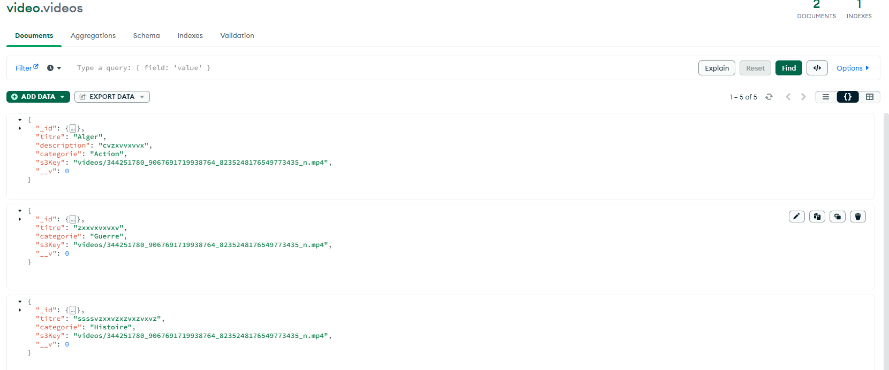
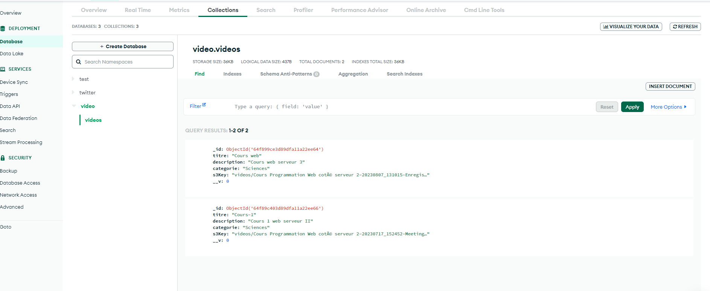

# VidéoCloud - Plateforme de Streaming Vidéo

VidéoCloud est une plateforme de streaming vidéo moderne qui permet aux utilisateurs de téléverser, diffuser des vidéos en toute simplicité.

## Table des matières

1. [Fonctionnalités/Endpoints](#fonctionnalités)
2. [Technologies Utilisées](#technologies-utilisées)
3. [Installation](#installation)
5. [Utilisation](#utilisation)
6. [Captures d'écran](#captures-décran)
7. [Auteurs](#auteurs)

## Fonctionnalités/Endpoints

L'application propose les fonctionnalités suivantes :

1. **Upload de Vidéos**  **POST /videos/upload** : cet endpoint permet de  téléversez facilement des vidéos au format MP4 avec des titres, des descriptions et des catégories pour une organisation efficace.

2. **Streaming de Vidéos**  **GET /videos/stream/:id**  : cet endpoint est utilisé pour regardez des vidéos en streaming fluide grâce à notre système de diffusion optimisé.

3. **Affichage de la liste des vidéos**  **GET /videos**  : cet endpoint permet de parcourez une liste de vidéos avec des informations détaillées, y compris les titres, les descriptions et les catégories.

4. **Supprimer une vidéo**   **GET /delete-video/:id** : Cet endpoint est utilisé pour supprimer une vidéo spécifique de l'application.

- Base de Données Solide : Nous utilisons MongoDB Atlas pour stocker de manière sécurisée les détails de vos vidéos, y compris les chemins d'accès AWS S3

- Interface Utilisateur Conviviale : Notre interface utilisateur intuitive, construite avec Pug, permet aux utilisateurs de téléverser des vidéos, de naviguer parmi elles et de les regarder en streaming sans effort.

## Technologies Utilisées

- Node.js, Express, MongoDB, AWS S3, Pug, body-parser, aws-sdk, multer, path

## Utilisation

1. Démarrez l'application : `npm start`
2. Ouvrez votre navigateur et accédez 
à l'application à l'adresse `http://localhost:3000/videos` ou `http://localhost:3000/ajouter-video`

## Captures d'écran

[Insérez ici des captures d'écran de votre application pour montrer son apparence et son fonctionnement.]

## Auteurs

- Badia Sellam
- Joelle Audet
- Mélanie Baril
